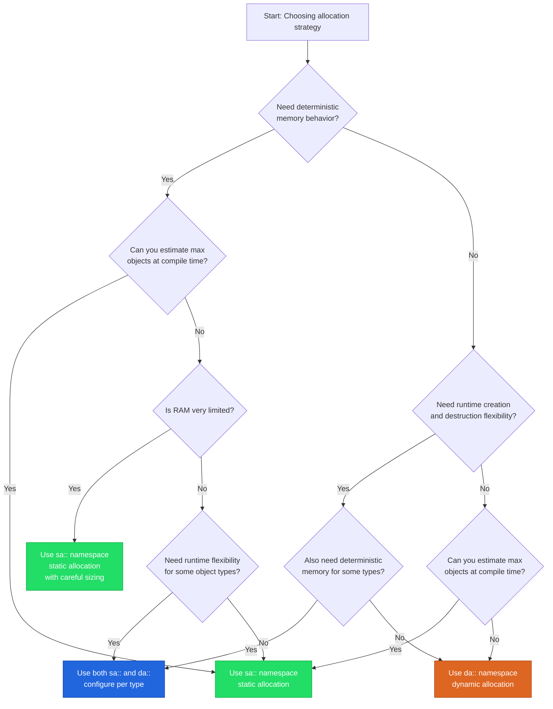
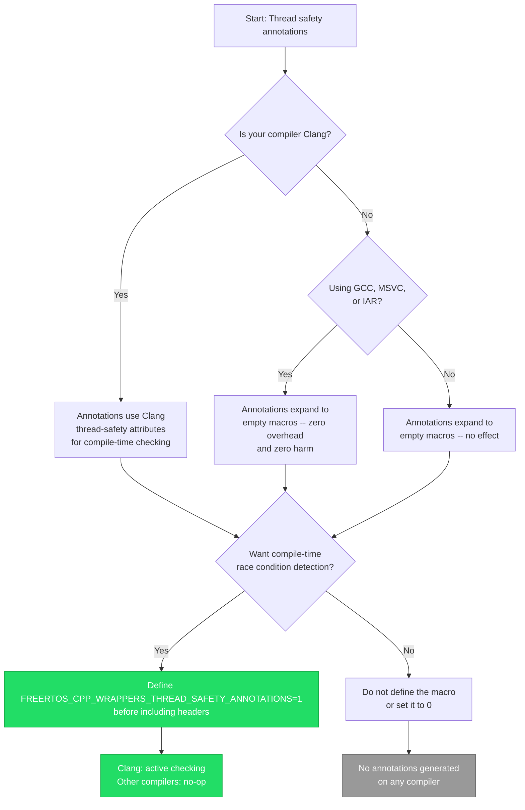
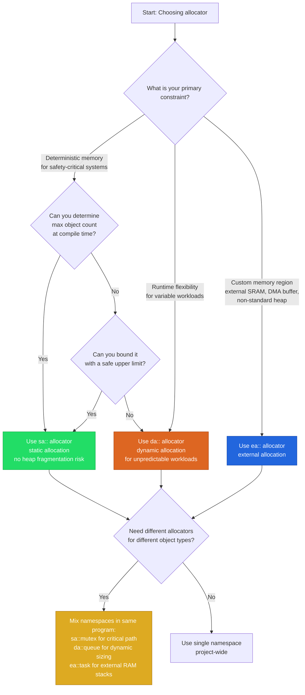

# Decision Trees

Visual decision flowcharts for choosing FreeRTOS C++ Wrappers v3.0.0 configurations.

## 1. Should I Use Static or Dynamic Allocation?



**Summary:**

| Strategy | Namespace | When to Use |
|----------|-----------|-------------|
| Static | `sa::` | Deterministic systems, RAM-constrained devices, compile-time known object counts |
| Dynamic | `da::` | Prototyping, variable workloads, runtime creation/destruction needed |
| Mixed | `sa::` + `da::` | Deterministic core with dynamic peripheral components |
| External | `ea::` | Custom memory regions (external SRAM, DMA buffers) |

Both allocation strategies can coexist in the same program. Configure per object type using the appropriate namespace or allocator template parameter.

## 2. Which Semaphore Type Should I Use?

```mermaid
flowchart TD
    A[Start: Choosing semaphore type] --> B{What is the primary<br/>use case?}
    B -->|Mutual exclusion| C{Need recursive locking?<br/>Same task locks multiple times}
    B -->|Signaling / event| D{One task signals<br/>another task?}
    B -->|Resource pool| E{Managing N identical<br/>resources?}

    C -->|Yes| F[Use recursive_mutex<br/>priority inheritance +<br/>recursive lock support]
    C -->|No| G[Use mutex<br/>priority inheritance +<br/>single lock semantics]

    D -->|Yes| H[Use binary_semaphore<br/>no priority inheritance<br/>lightweight signaling]

    E -->|Yes| I[Use counting_semaphore<br/>count tracks available resources]

    G --> J{Need RAII lock guard?}
    F --> J
    J -->|Yes| K[Use lock_guard or<br/>timeout_lock_guard]
    J -->|No| L[Use lock()/unlock() directly]

    style F fill:#26d,stroke:#14a,color:#fff
    style G fill:#2d6,stroke:#1a4,color:#fff
    style H fill:#d62,stroke:#a41,color:#fff
    style I fill:#da2,stroke:#a71,color:#fff
    style K fill:#2d6,stroke:#1a4,color:#fff
```

**Summary:**

| Type | Priority Inheritance | Use Case |
|------|---------------------|----------|
| `mutex` | Yes | Protecting shared data from concurrent access |
| `recursive_mutex` | Yes | Reentrant functions that need recursive locking |
| `binary_semaphore` | No | Task synchronization, ISR signaling |
| `counting_semaphore` | No | Managing pools of identical resources |

**Important:** Never use binary_semaphore for mutual exclusion. It lacks priority inheritance, which can cause priority inversion in real-time systems. Use `mutex` instead.

## 3. Should I Enable Thread Safety Annotations?



**Summary:**

The annotation system is opt-in via the `FREERTOS_CPP_WRAPPERS_THREAD_SAFETY_ANNOTATIONS` macro. It is not auto-detected.

- **On Clang:** Annotations become `__attribute__((capability(...)))`, `__attribute__((acquire_capability(...)))`, etc. -- enabling compile-time detection of potential race conditions.
- **On other compilers:** Annotations expand to nothing. Zero cost, zero risk.
- **Recommendation:** Enable it in CI builds regardless of compiler. It is free on non-Clang toolchains and provides real value on Clang.

```cpp
// CMake or compiler flags
-DFREERTOS_CPP_WRAPPERS_THREAD_SAFETY_ANNOTATIONS=1
```

## 4. Should I Use the Expected API?

```mermaid
flowchart TD
    A[Start: Choosing error handling API] --> B{Want structured error<br/>handling instead of<br/>checking return codes?}

    B -->|No| C[Use classic API only<br/>methods return BaseType_t / bool]

    B -->|Yes| D{What C++ standard<br/>is available?}

    D -->|C++20 or later| E{Does your standard library<br/>support std::expected?}
    E -->|Yes| F[Uses std::expected<T, error><br/>from the standard library]
    E -->|No| G[Uses freertos::expected<T, error><br/>built-in polyfill]

    D -->|C++17 only| G

    F --> H[Use _ex() suffixed methods<br/>returning expected<T, error>]
    G --> H

    H --> I[Example: expected<void, error> result =<br/>mutex.lock_ex(timeout);<br/>if (!result) { handle(result.error()); }]

    C --> J[Example: BaseType_t result =<br/>mutex.lock(timeout);<br/>if (result != pdTRUE) { handle_error(); }]

    style H fill:#2d6,stroke:#1a4,color:#fff
    style I fill:#2d6,stroke:#1a4,color:#fff
    style J fill:#999,stroke:#666,color:#fff
```

**Summary:**

| API Variant | Method Suffix | Return Type | Error Info |
|-------------|---------------|-------------|-----------|
| Classic | (none) | `BaseType_t`, `bool` | pdTRUE/pdFALSE only |
| Expected | `_ex()` | `expected<T, error>` | Specific error codes: `timeout`, `would_block`, `semaphore_not_owned`, etc. |

The `freertos::expected` polyfill activates automatically when `std::expected` is not available (C++17). On C++20 with a conforming standard library, it delegates to `std::expected`.

The `error` enum provides structured distinction between failure modes:

```cpp
enum class error : uint8_t {
    ok, timeout, would_block, queue_full,
    queue_empty, semaphore_not_owned,
    invalid_handle, out_of_memory, invalid_parameter
};
```

## 5. Which ISR API Variant Should I Use?

```mermaid
flowchart TD
    A[Start: Calling from ISR or task context?] --> B{Are you inside<br/>an interrupt service routine?}

    B -->|No, task context| C{Want structured<br/>error handling?}
    C -->|No| D[Use regular methods<br/>e.g., sem.give(), mutex.lock()]
    C -->|Yes| E[Use _ex() methods<br/>e.g., sem.give_ex(), mutex.lock_ex()]

    B -->|Yes, ISR context| F{Want structured<br/>error handling from ISR?}
    F -->|No| G[Use _isr() methods<br/>returning isr_result<T><br/>e.g., sem.give_isr(), sem.take_isr()]
    F -->|Yes| H[Use _ex_isr() methods<br/>returning isr_result<expected<T, error>><br/>e.g., sem.give_ex_isr(), mutex.lock_ex_isr()]

    G --> I[isr_result combines:<br/>result value + higher_priority_task_woken]
    H --> J[isr_result combines:<br/>expected<T, error> + higher_priority_task_woken]

    style D fill:#2d6,stroke:#1a4,color:#fff
    style E fill:#2d6,stroke:#1a4,color:#fff
    style G fill:#d62,stroke:#a41,color:#fff
    style H fill:#26d,stroke:#14a,color:#fff
```

**Summary:**

| Context | Classic | Expected |
|---------|---------|----------|
| Task | `sem.give()` | `sem.give_ex()` |
| ISR | `sem.give_isr()` | `sem.give_ex_isr()` |

**ISR result structure:**

```cpp
template <typename T> struct isr_result {
    T result;                          // Value or error info
    BaseType_t higher_priority_task_woken; // Must pass to portYIELD_FROM_ISR
};
```

After every ISR call, check `higher_priority_task_woken` and pass it to `portYIELD_FROM_ISR()` to perform a context switch if a higher-priority task was woken.

**Critical rule:** Never call non-ISR methods from an ISR context. The `_isr()` and `_ex_isr()` variants use the FreeRTOS `FromISR` API calls that are safe for interrupt context.

## 6. Which Allocator for My Scenario?



**Summary:**

| Namespace | Allocator | Template Parameter | Memory Source |
|-----------|-----------|-------------------|---------------|
| `sa::` | `static_*_allocator` | Compile-time sized | BSS/static buffer |
| `da::` | `dynamic_*_allocator` | Heap (pvPortMalloc) | FreeRTOS heap |
| `ea::` | `external_*_allocator` | User-provided region | Custom (external SRAM, DMA, etc.) |

**External allocator usage requires:**

1. `configSUPPORT_STATIC_ALLOCATION` must be enabled (external allocators delegate to static creation functions).
2. Define an `external_memory_region` struct with `allocate` and `deallocate` function pointers.
3. Pass the region to the external allocator, which manages memory from your custom area.

All three allocator strategies can coexist in the same program. Allocate each object type from the most appropriate memory region.

## 7. Should I Enable Queue Sets?

```mermaid
flowchart TD
    A[Start: Queue set decision] --> B{Do you need to wait on<br/>multiple queues or semaphores<br/>simultaneously?}

    B -->|Yes| C{Do multiple producer<br/>objects feed into a single<br/>consumer task?}
    C -->|Yes| D[Enable configUSE_QUEUE_SETS=1<br/>and use freertos::queue_set]

    C -->|No| E{Do you need to multiplex<br/>events from different<br/>sources in one blocking call?}
    E -->|Yes| D

    B -->|No| F{Only waiting on a single<br/>queue or semaphore at a time?}
    F -->|Yes| G[Do not enable queue sets<br/>Use plain receive/take<br/>with individual timeouts]

    D --> H[Usage pattern:<br/>1. Create queue_set with total event capacity<br/>2. Add queues and semaphores via add()<br/>3. Block on select() to wait for any member<br/>4. Read from the returned member handle]

    G --> I[Simple single-object waits<br/>are more efficient:<br/>fewer allocations, smaller footprint]

    style D fill:#2d6,stroke:#1a4,color:#fff
    style G fill:#999,stroke:#666,color:#fff
```

**Summary:**

Queue sets are a FreeRTOS feature that allows a task to block on multiple synchronization primitives simultaneously. They are useful when a single consumer task must respond to events from multiple producers.

**Prerequisites:**
- Set `configUSE_QUEUE_SETS` to `1` in `FreeRTOSConfig.h`
- The library detects this via `FREERTOS_CPP_WRAPPERS_HAS_QUEUE_SET` in `freertos_config.hpp`

**When not to use queue sets:**
- You only wait on one object at a time
- You can restructure your design to use a single queue with an event message type
- Memory and code size are extremely constrained (queue sets add overhead)

**Queue set API highlights:**

```cpp
freertos::da::queue_set qs(10);              // total event capacity
qs.add(my_queue.get_handle());               // add a queue
qs.add(my_semaphore.get_handle());           // add a semaphore
auto member = qs.select(timeout);            // block until any member is ready
```

The `_ex()` and `_ex_isr()` variants provide structured error handling for queue set operations, consistent with the rest of the library API.