# FreeRTOS C++ Wrappers v2.0.0 — Issue Dependency Diagram

## Dependency Graph (Mermaid)

```mermaid
graph TD
    subgraph Phase1["Phase 1: Foundation"]
        P1_01["#78 P1-01<br/>freertos_config.hpp"]
        P1_02["#80 P1-02<br/>freertos_expected.hpp"]
        P1_03["#79 P1-03<br/>freertos_span.hpp"]
        P1_04["#81 P1-04<br/>tick_timer clock"]
        P1_05["#82 P1-05<br/>C++20 concepts"]
    end

    subgraph Phase2["Phase 2: Core"]
        P2_06["#83 P2-06<br/>Move semantics"]
        P2_07["#84 P2-07<br/>External allocators"]
        P2_08["#85 P2-08<br/>Strong typedefs"]
    end

    subgraph Phase3["Phase 3: API"]
        P3_09["#86 P3-09<br/>Expected API *_ex()"]
        P3_10["#87 P3-10<br/>Dual API std names"]
        P3_11["#88 P3-11<br/>Thread safety attrs"]
        P3_28["#104 P3-28<br/>unique_lock / scoped_lock"]
        P3_29["#105 P3-29<br/>call_once"]
        P3_30["#106 P3-30<br/>atomic<T> / atomic_flag"]
    end

    subgraph Phase4["Phase 4: FreeRTOS Features"]
        P4_12["#89 P4-12<br/>Indexed notifications"]
        P4_13["#90 P4-13<br/>SMP core affinity"]
        P4_14["#91 P4-14<br/>Stream batching buf"]
        P4_15["#93 P4-15<br/>Queue set"]
        P4_16["#92 P4-16<br/>Callbacks, ISR reset"]
        P4_17["#94 P4-17<br/>Misc FreeRTOS APIs"]
    end

    subgraph Phase5["Phase 5: Additions"]
        P5_18["#95 P5-18<br/>condition_variable_any"]
        P5_19["#96 P5-19<br/>task::join()"]
        P5_20["#97 P5-20<br/>ISR auto-detect"]
        P5_21["#98 P5-21<br/>pend_call, shared_data"]
        P5_22["#99 P5-22<br/>callback SBO"]
        P5_23["#100 P5-23<br/>new/delete redirect"]
        P5_31["#107 P5-31<br/>thread / jthread / stop_token"]
        P5_32["#108 P5-32<br/>timed_mutex / recursive_timed_mutex"]
        P5_33["#109 P5-33<br/>shared_mutex (RW lock)"]
        P5_34["#110 P5-34<br/>latch"]
    end

    subgraph Phase6["Phase 6: QA"]
        P6_24["#101 P6-24<br/>Update & add tests"]
        P6_26["#102 P6-26<br/>Documentation"]
        P6_27["#103 P6-27<br/>V&V report"]
    end

    %% Phase 1 → Phase 2
    P1_01 --> P2_06
    P1_01 --> P2_07
    P1_01 --> P2_08
    P1_05 --> P2_07

    %% Phase 1 → Phase 3
    P1_02 --> P3_09
    P1_01 --> P3_11

    %% Phase 2 → Phase 3
    P2_06 --> P3_09
    P2_06 --> P3_10
    P1_04 --> P3_10

    %% Phase 3 internal
    P3_10 --> P3_11

    %% Phase 3 — new C++ std primitives
    P3_10 --> P3_28
    P2_06 --> P3_28
    P1_01 --> P3_29
    P1_01 --> P3_30
    P1_05 --> P3_30

    %% Phase 1,2 → Phase 4
    P1_01 --> P4_12
    P1_01 --> P4_13
    P1_01 --> P4_14
    P1_01 --> P4_15
    P1_01 --> P4_16
    P1_01 --> P4_17
    P1_03 --> P4_14
    P2_06 --> P4_12
    P2_06 --> P4_13
    P2_06 --> P4_14
    P2_06 --> P4_15
    P2_08 --> P4_13

    %% Phase 2,3 → Phase 5
    P3_10 --> P5_18
    P1_04 --> P5_18
    P2_06 --> P5_19
    P1_02 --> P5_19
    P1_01 --> P5_20
    P3_10 --> P5_21
    P1_02 --> P5_21
    P2_06 --> P5_21
    P1_05 --> P5_22
    P2_06 --> P5_22
    P1_01 --> P5_23

    %% Phase 5 — new C++ std primitives
    P3_28 --> P5_18
    P5_19 --> P5_31
    P1_05 --> P5_31
    P5_22 --> P5_31
    P3_10 --> P5_32
    P1_04 --> P5_32
    P2_07 --> P5_33
    P3_10 --> P5_33
    P3_11 --> P5_33
    P1_04 --> P5_33
    P1_01 --> P5_34
    P1_05 --> P5_34

    %% All → Phase 6
    P4_12 --> P6_24
    P4_13 --> P6_24
    P4_14 --> P6_24
    P4_15 --> P6_24
    P4_16 --> P6_24
    P4_17 --> P6_24
    P5_18 --> P6_24
    P5_19 --> P6_24
    P5_20 --> P6_24
    P5_21 --> P6_24
    P5_22 --> P6_24
    P5_23 --> P6_24
    P5_31 --> P6_24
    P5_32 --> P6_24
    P5_33 --> P6_24
    P5_34 --> P6_24
    P3_09 --> P6_24
    P3_10 --> P6_24
    P3_11 --> P6_24
    P3_28 --> P6_24
    P3_29 --> P6_24
    P3_30 --> P6_24

    P6_24 --> P6_26
    P6_24 --> P6_27
    P6_26 --> P6_27

    %% Styling
    classDef p1 fill:#1D76DB,stroke:#0D5BA6,color:#fff
    classDef p2 fill:#5319E7,stroke:#3A0FA0,color:#fff
    classDef p3 fill:#B60205,stroke:#8C0104,color:#fff
    classDef p4 fill:#FBCA04,stroke:#C9A203,color:#000
    classDef p5 fill:#D93F0B,stroke:#A83009,color:#fff
    classDef p6 fill:#0E8A16,stroke:#0A6B11,color:#fff

    class P1_01,P1_02,P1_03,P1_04,P1_05 p1
    class P2_06,P2_07,P2_08 p2
    class P3_09,P3_10,P3_11,P3_28,P3_29,P3_30 p3
    class P4_12,P4_13,P4_14,P4_15,P4_16,P4_17 p4
    class P5_18,P5_19,P5_20,P5_21,P5_22,P5_23,P5_31,P5_32,P5_33,P5_34 p5
    class P6_24,P6_26,P6_27 p6
```



## Issue Index

| Issue | Title | Phase | Depends On |
|-------|-------|-------|------------|
| #78 | P1-01 Feature detection: freertos_config.hpp | 1 | — |
| #80 | P1-02 std::expected polyfill + error enum | 1 | — |
| #79 | P1-03 std::span polyfill | 1 | — |
| #81 | P1-04 tick_timer TrivialClock | 1 | — |
| #82 | P1-05 C++20 concepts | 1 | #78 |
| #83 | P2-06 Full move semantics | 2 | #78 |
| #84 | P2-07 External memory allocation | 2 | #78, #82, #83 |
| #85 | P2-08 Strong typedefs | 2 | #78 |
| #86 | P3-09 Expected API *_ex() | 3 | #80, #83 |
| #87 | P3-10 Dual API: std names | 3 | #81, #83 |
| #88 | P3-11 Thread safety annotations | 3 | #78, #87 |
| #104 | P3-28 unique_lock / scoped_lock | 3 | #87, #83 |
| #105 | P3-29 call_once | 3 | #78 |
| #106 | P3-30 atomic<T> / atomic_flag | 3 | #78, #82 |
| #89 | P4-12 Indexed notifications | 4 | #78, #83 |
| #90 | P4-13 SMP core affinity | 4 | #78, #83, #85 |
| #91 | P4-14 Stream batching buffer | 4 | #78, #79, #83 |
| #93 | P4-15 Queue set | 4 | #78, #83 |
| #92 | P4-16 Callbacks, ISR reset, etc. | 4 | #78 |
| #94 | P4-17 Misc FreeRTOS APIs | 4 | #78 |
| #95 | P5-18 condition_variable_any | 5 | #87, #81 |
| #96 | P5-19 task::join()/joinable() | 5 | #83, #80 |
| #97 | P5-20 ISR auto-detection | 5 | #78 |
| #98 | P5-21 pend_call, shared_data, claim | 5 | #87, #80, #83 |
| #99 | P5-22 Fixed-capacity callback (SBO) | 5 | #82, #83 |
| #100 | P5-23 new/delete redirect + static memory | 5 | #78 |
| #107 | P5-31 thread / jthread / stop_token | 5 | #96, #82, #84, #98 |
| #108 | P5-32 timed_mutex / recursive_timed_mutex | 5 | #87, #81 |
| #109 | P5-33 shared_mutex (RW lock) | 5 | #84, #87, #88, #81 |
| #110 | P5-34 latch | 5 | #78, #82 |
| #101 | P6-24 Update & add tests | 6 | All P1-P5 |
| #102 | P6-26 Documentation update | 6 | All P1-P5 |
| #103 | P6-27 V&V report | 6 | #101, #102 |

## Critical Path

The longest dependency chain determines the minimum implementation time:

```
#78 → #83 → #87 → #88 (5 steps: Phase 1→2→3)
#78 → #83 → #87 → #104 → #95 (5 steps: Phase 1→2→3→3→5)  ← NEW LONGEST
#78 → #83 → #87 → #109 (5 steps: Phase 1→2→3→5)
#80 → #86 → tests (3 steps: Phase 1→3→6)
```

**Critical path**: `P1-01 → P2-06 → P3-10 → P3-28 → P5-18` (5 issues, 4 dependencies)

The `unique_lock` (P3-28) is now on the critical path because `condition_variable_any` (#95) depends on it.

## Parallelization Opportunities

Issues with no mutual dependencies can be worked on in parallel within each phase:

- **Phase 1**: All 5 issues are independent (maximum parallelism)
- **Phase 2**: P2-08 is independent of P2-06 and P2-07
- **Phase 3**: P3-09, P3-10, P3-28, P3-29, P3-30 are mostly independent of each other (P3-28 needs P3-10 and P2-06)
- **Phase 4**: P4-12 through P4-17 are independent of each other
- **Phase 5**: All 10 issues have partial dependencies but can be parallelized within groups
- **Phase 6**: P6-24 and P6-26 can partially overlap